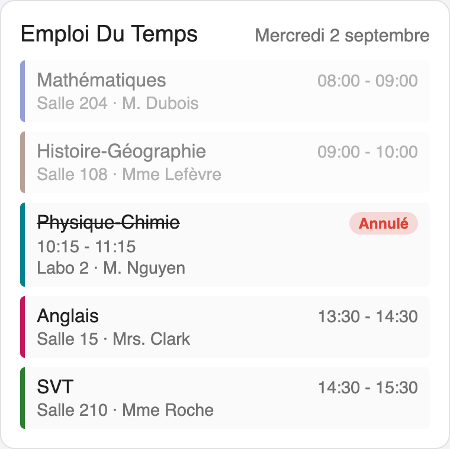
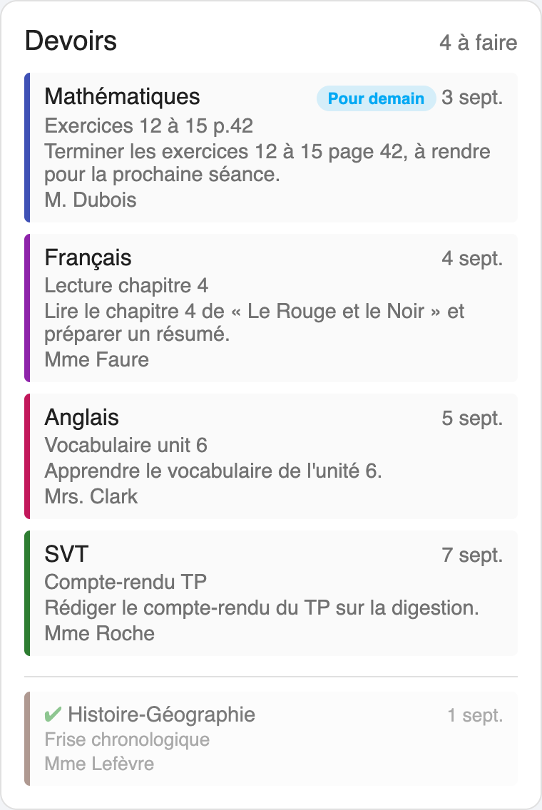
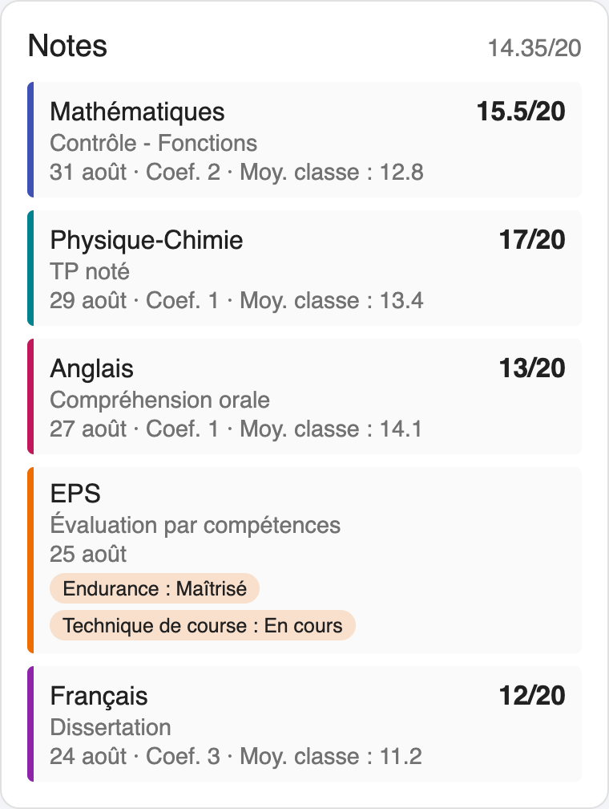
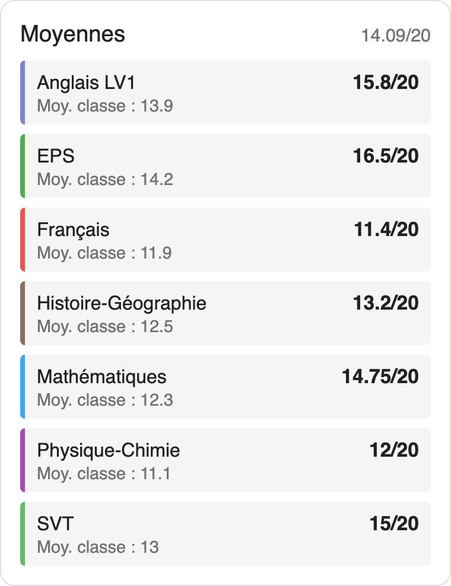
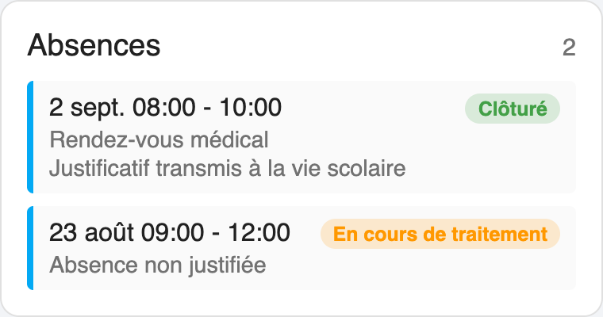

# Skolengo pour Home Assistant

Intégration **communautaire et non officielle** pour [Skolengo](https://www.skolengo.com/), permettant de récupérer dans Home Assistant l'emploi du temps, les devoirs, les absences et (dans la mesure du possible) les notes d'un élève.

> **Avertissement** : ce projet n'est ni développé, ni maintenu, ni approuvé par Skolengo ou Index Education. Il s'appuie sur une analyse non officielle de l'API utilisée par l'application mobile Skolengo, qui peut changer ou être bloquée à tout moment sans préavis. Utilisez-le à vos risques et périls, avec vos propres identifiants.

Ce projet s'inspire fonctionnellement de l'excellente intégration [hass-pronote](https://github.com/delphiki/hass-pronote), qui fait la même chose pour Pronote.

## Fonctionnalités

- **Calendrier `calendar.emploi_du_temps`** : l'emploi du temps de l'élève (cours, salle, professeur(s), cours annulés), directement exploitable dans les vues Calendrier de Home Assistant ou dans vos automatisations.
- **Calendrier `calendar.devoirs`** : les devoirs à venir, avec leur date de rendu, sous forme d'événements toute la journée.
- **Capteurs** :
  - Prochain cours
  - Prochain réveil (`sensor.skolengo_..._next_alarm`, horodatage) : heure du premier cours du prochain jour d'école, moins un délai réglable (temps de préparation), pratique pour déclencher une automatisation de réveil. Passe automatiquement au jour suivant une fois l'heure de réveil du jour dépassée (week-ends et vacances sans cours sont sautés).
  - Nombre de cours aujourd'hui
  - Nombre de devoirs à faire
  - Nombre d'absences enregistrées (+ retards et dispenses, capteurs séparés)
  - Notes (nombre de notes/évaluations enregistrées, détail en attribut)
  - Moyenne générale (meilleur effort, voir limitations ci-dessous)
  - Classe, avec date de naissance / régime / établissement en attributs
- **Cartes Lovelace intégrées** (emploi du temps, devoirs, notes, absences), chargées automatiquement — voir [Cartes Lovelace intégrées](#cartes-lovelace-intégrées).
- Rafraîchissement automatique périodique (30 minutes par défaut, réglable dans les options de l'intégration). Le délai de préparation utilisé pour le capteur "Prochain réveil" (60 minutes par défaut) est réglable au même endroit.
- Gestion des comptes "représentant légal" (parent) reliés à plusieurs enfants : un élève par intégration, ajoutez l'intégration plusieurs fois pour suivre plusieurs enfants.

## Installation

### Via HACS (recommandé)

1. Dans HACS, ouvrez le menu **⋮ → Dépôts personnalisés (Custom repositories)**.
2. Ajoutez l'URL de ce dépôt (`https://github.com/infernalK/ha-skolengo`) avec la catégorie **Intégration**.
3. Recherchez "Skolengo" dans HACS et installez-le.
4. Redémarrez Home Assistant.

### Installation manuelle

1. Copiez le dossier `custom_components/skolengo` de ce dépôt dans le dossier `custom_components` de votre configuration Home Assistant.
2. Redémarrez Home Assistant.

## Configuration

1. Allez dans **Paramètres → Appareils et services → Ajouter une intégration**.
2. Recherchez **Skolengo**.
3. Renseignez le nom ou la ville de votre établissement, puis sélectionnez-le dans la liste (si plusieurs résultats).
4. Entrez vos identifiants de connexion Skolengo (les mêmes que pour l'application mobile ou le site web de votre établissement).
5. Si votre compte est relié à plusieurs enfants, choisissez celui à suivre.

Le mot de passe n'est utilisé qu'au moment de la connexion initiale : seul un jeton de rafraîchissement (`refresh_token`) est conservé par la suite pour renouveler automatiquement l'accès.

### Options

Depuis la page de l'intégration, le bouton **Configurer** permet d'ajuster l'intervalle de rafraîchissement des données (30 minutes par défaut).

## Limitations connues

- **Connexion** : Skolengo ne propose pas de mécanisme de connexion générique documenté. L'authentification implémentée ici "scrape" (analyse) génériquement la page de connexion CAS/SSO de votre établissement (recherche des champs identifiant/mot de passe usuels). Cette approche fonctionne pour de nombreux établissements, mais certains ENT régionaux utilisent des parcours de connexion multi-étapes ou non standards qui ne seront pas reconnus automatiquement. Si la connexion échoue avec une erreur "Identifiants incorrects ou formulaire de connexion non pris en charge", merci d'ouvrir une [issue GitHub](https://github.com/infernalK/ha-skolengo/issues) en décrivant votre établissement (sans jamais partager vos identifiants ni mot de passe).
- **Notes et absences** : les endpoints évaluations/notes et absences sont connus pour être instables ou indisponibles selon les établissements dans l'API Skolengo elle-même (pas seulement dans cette intégration) — par exemple une erreur serveur 500 sur `/absence-files` a déjà été observée sur un établissement, indépendante de cette intégration. Les capteurs correspondants peuvent donc rester à `inconnu` pour votre établissement — ce n'est pas nécessairement un bug de l'intégration.
- Cette intégration ne propose pas d'envoi de notifications ni de liste de tâches (todo) : elle se concentre sur l'exposition des données via calendriers, capteurs et les cartes Lovelace décrites ci-dessous, que vous pouvez ensuite combiner librement avec vos propres automatisations et cartes standard de Home Assistant.

## Cartes Lovelace intégrées

Cette intégration embarque 5 cartes Lovelace personnalisées, directement inspirées de celles du projet [lovelace-pronote](https://github.com/delphiki/lovelace-pronote) (le compagnon Lovelace de `hass-pronote`), adaptées au modèle de données de Skolengo.

Contrairement à Pronote, Skolengo ne distingue pas notes numériques / évaluations de compétences (un seul objet "évaluation" qui porte soit une note, soit des niveaux de compétences) et ne propose pas d'endpoint dédié aux retards. Le périmètre est donc volontairement de **5 cartes** (au lieu de 7) : pas de carte "évaluations" séparée de la carte "notes", pas de carte "retards".

Elles sont **chargées automatiquement** dès que l'intégration est configurée : aucune ressource Lovelace à ajouter manuellement (`skolengo-cards.js` est servi par l'intégration elle-même et enregistré comme module JS au démarrage de Home Assistant).

*Les captures ci-dessous sont générées à partir des cartes réelles avec des données d'exemple, à titre illustratif.*

### `skolengo-timetable-card`

Emploi du temps du jour (ou du prochain jour d'école s'il n'y a plus de cours aujourd'hui), à associer à un capteur `..._timetable_next_day`.



```yaml
type: custom:skolengo-timetable-card
entity: sensor.skolengo_..._timetable_next_day
display_teacher: true
dim_ended_lessons: true
```

### `skolengo-homework-card`

Devoirs à faire, à associer à un capteur `..._homework_due`.



```yaml
type: custom:skolengo-homework-card
entity: sensor.skolengo_..._homework_due
display_done_homework: true
max_items: 15
```

### `skolengo-evaluations-card`

Notes et évaluations de compétences ("Notes"), à associer au capteur `..._notes` (celui qui porte le nombre de notes ; le détail de chaque note est dans son attribut `evaluations`). Le capteur `..._moyenne_generale` reste séparé et ne porte que la moyenne chiffrée.



```yaml
type: custom:skolengo-evaluations-card
entity: sensor.skolengo_..._notes
title: Notes
display_class_average: true
```

### `skolengo-averages-card`

Moyenne générale et détail des moyennes par matière, à associer au capteur `..._moyenne_generale`. Ce capteur porte la moyenne générale (pondérée par coefficient) comme état, et le détail par matière (`by_subject` : moyenne de l'élève et de la classe pour chaque matière, elle-même pondérée par coefficient si la matière a été suivie sur plusieurs périodes) en attribut.



```yaml
type: custom:skolengo-averages-card
entity: sensor.skolengo_..._moyenne_generale
title: Moyennes
display_class_average: true
```

### `skolengo-absences-card`

Absences enregistrées, à associer à un capteur `..._absences`. Skolengo remonte en réalité un seul journal "vie scolaire" (absences, retards, dispenses) : cette même carte fonctionne donc aussi telle quelle pointée sur `..._delays` (retards) ou `..._exemptions` (dispenses, capteur désactivé par défaut), sans qu'il soit nécessaire d'utiliser une carte différente.



```yaml
type: custom:skolengo-absences-card
entity: sensor.skolengo_..._absences
display_comment: true
```

```yaml
type: custom:skolengo-absences-card
entity: sensor.skolengo_..._delays
title: Retards
```

**Note** : les "observations", punitions et sanctions visibles sur le portail web complet de Skolengo (rubrique "Vie scolaire") ne sont couvertes par aucun endpoint exposé par l'API utilisée ici (celle de l'application mobile, `api.skolengo.com`) — elles ne semblent accessibles que via les pages web propres à l'ENT Kosmos de l'établissement. Les cartes absences/retards/dispenses représentent donc la couverture maximale possible actuellement pour la "vie scolaire", pas une limitation volontaire.

## Signaler un problème

Ouvrez une [issue sur GitHub](https://github.com/infernalK/ha-skolengo/issues) en précisant :

- la version de Home Assistant et de l'intégration,
- le journal d'erreur pertinent (`Paramètres → Système → Journaux`), en masquant toute information personnelle,
- **ne partagez jamais** votre identifiant, mot de passe, jeton d'accès ou de rafraîchissement dans une issue publique.

## Licence

[MIT](LICENSE)
