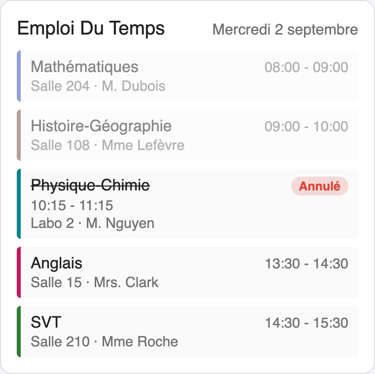
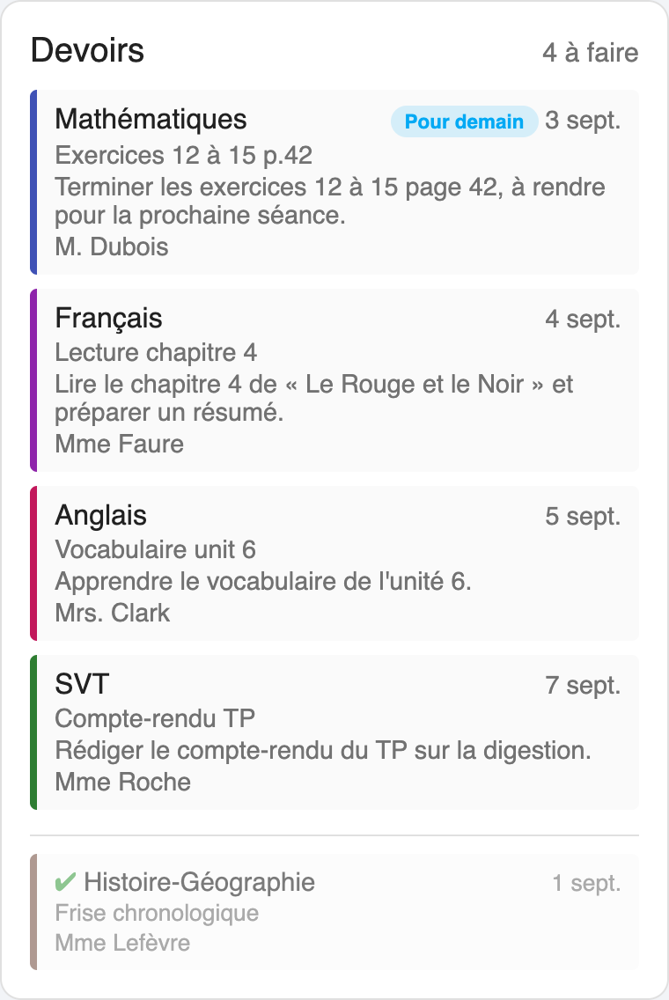
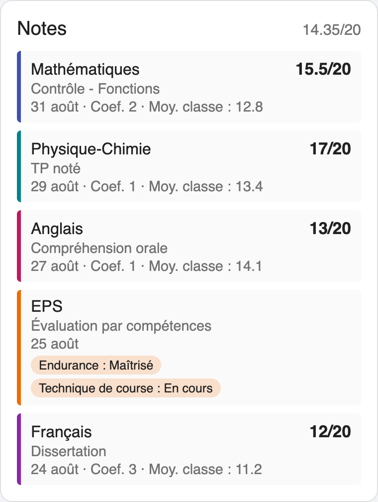
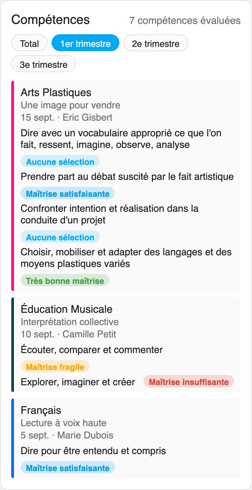
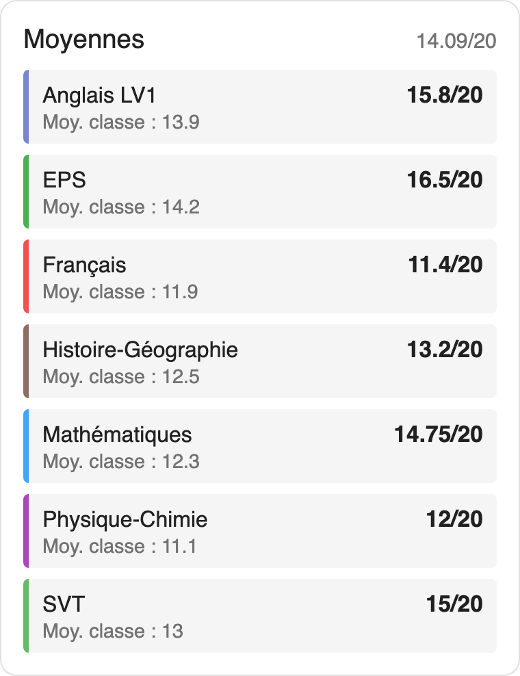
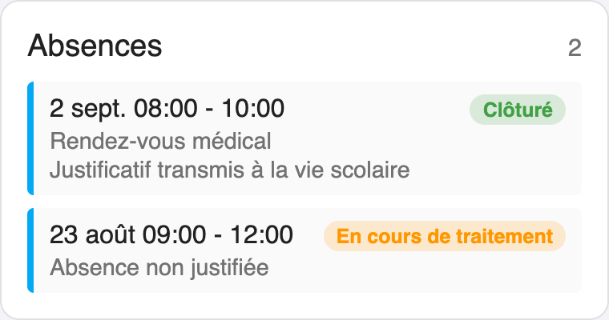
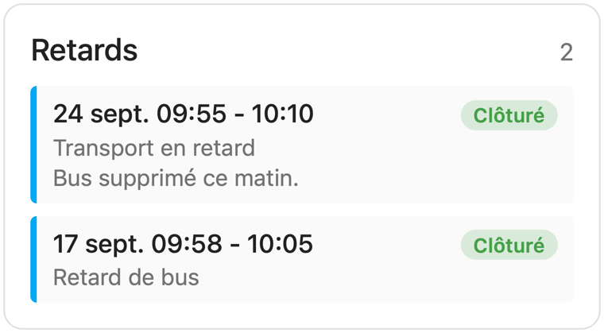
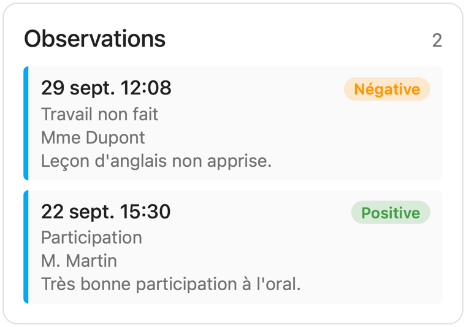
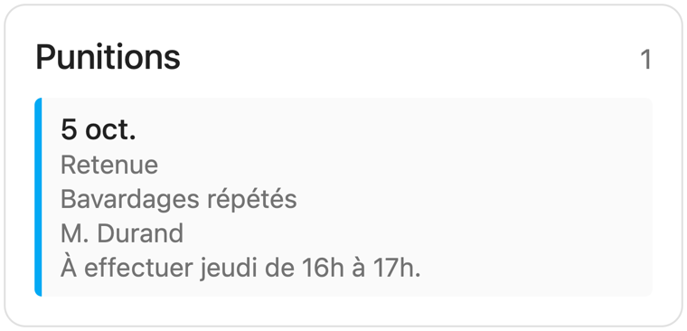
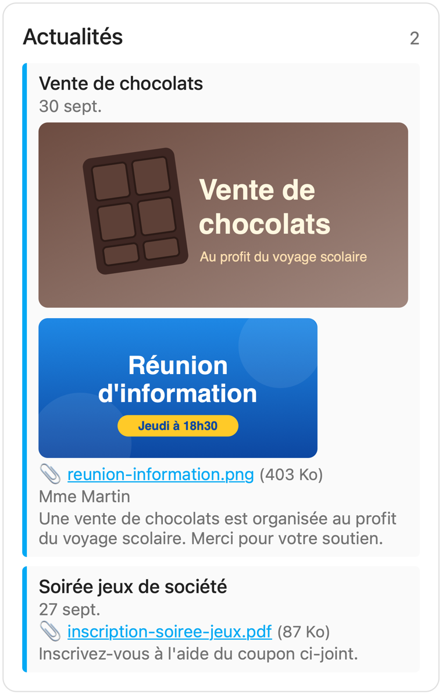

# Skolengo pour Home Assistant

[](https://github.com/infernalK/ha-skolengo/actions/workflows/tests.yaml)
[](https://github.com/infernalK/ha-skolengo/actions/workflows/hassfest.yaml)
[](https://github.com/infernalK/ha-skolengo/actions/workflows/hacs.yaml)
[](https://github.com/infernalK/ha-skolengo/releases)
[](LICENSE)

Intégration **communautaire et non officielle** pour [Skolengo](https://www.skolengo.com/), permettant de récupérer dans Home Assistant l'emploi du temps, les devoirs, la vie scolaire (absences, retards, observations, punitions), les actualités de l'établissement et (dans la mesure du possible) les notes d'un élève.

> **Avertissement** : ce projet n'est ni développé, ni maintenu, ni approuvé par Skolengo ou Index Education. Il s'appuie sur une analyse non officielle de l'API utilisée par l'application mobile Skolengo, qui peut changer ou être bloquée à tout moment sans préavis. Utilisez-le à vos risques et périls, avec vos propres identifiants.

Ce projet s'inspire fonctionnellement de l'excellente intégration [hass-pronote](https://github.com/delphiki/hass-pronote), qui fait la même chose pour Pronote.

## Fonctionnalités

- **Calendrier `calendar.emploi_du_temps`** : l'emploi du temps de l'élève (cours, salle, professeur(s), cours annulés), directement exploitable dans les vues Calendrier de Home Assistant ou dans vos automatisations.
- **Calendrier `calendar.devoirs`** : les devoirs à venir, avec leur date de rendu, sous forme d'événements toute la journée.
- **Capteurs** :
  - Prochain cours
  - Prochain réveil (`sensor.skolengo_..._next_alarm`, horodatage) : heure du premier cours du prochain jour d'école, moins un délai réglable (temps de préparation), pratique pour déclencher une automatisation de réveil. Passe automatiquement au jour suivant une fois l'heure de réveil du jour dépassée (week-ends et vacances sans cours sont sautés).
  - Nombre de cours aujourd'hui
  - Nombre de devoirs à faire
  - Nombre d'absences enregistrées (+ retards, dispenses, observations et punitions, capteurs séparés)
  - Notes (nombre de notes/évaluations enregistrées, détail en attribut)
  - Moyenne générale (meilleur effort, voir limitations ci-dessous)
  - Classe, avec date de naissance / régime / établissement en attributs
  - Actualités de l'établissement (`sensor.skolengo_<établissement>_actualites`) : titre de la dernière actualité, avec la liste des 10 plus récentes (texte, image, pièces jointes) en attributs. Un seul capteur par établissement, sur un appareil « Skolengo - *établissement* », même si plusieurs enfants y sont scolarisés.
- **Événement `skolengo_event`** (types `new_grade`, `new_homework`, `lesson_canceled`, `lesson_modified`, `lesson_added`, `new_absence`, `new_delay`, `new_observation`, `new_punishment` et `new_news`) : émis sur le bus d'événements Home Assistant dès qu'une nouvelle note/évaluation, un nouveau devoir, une nouvelle absence, un nouveau retard, une nouvelle observation, une nouvelle punition ou une nouvelle actualité de l'établissement apparaît, qu'un cours déjà connu est annulé ou change d'horaire/salle/prof, ou qu'un cours est réellement ajouté à l'emploi du temps (rien n'est émis pour ce qui est déjà présent/dans cet état lors du démarrage), à l'image du `pronote_event` de hass-pronote — pratique pour déclencher une notification dans une automatisation. Voir [Exemples d'automatisations](#exemples-dautomatisations) ci-dessous.
- **Cartes Lovelace intégrées** (emploi du temps, devoirs, notes, absences, retards, observations, punitions, actualités), chargées automatiquement — voir [Cartes Lovelace intégrées](#cartes-lovelace-intégrées).
- Rafraîchissement automatique périodique (30 minutes par défaut, réglable dans les options de l'intégration). Le délai de préparation utilisé pour le capteur "Prochain réveil" (60 minutes par défaut) est réglable au même endroit.
- Gestion des comptes "représentant légal" (parent) reliés à plusieurs enfants : un élève par intégration, ajoutez l'intégration plusieurs fois pour suivre plusieurs enfants. Les actualités, qui appartiennent à l'établissement, ne sont pas dupliquées : un seul capteur et un seul événement par article, même avec deux enfants dans le même collège.

## Installation

### Via HACS (recommandé)

1. Dans HACS, ouvrez le menu **⋮ → Dépôts personnalisés (Custom repositories)**.
2. Ajoutez l'URL de ce dépôt (`https://github.com/infernalK/ha-skolengo`) avec la catégorie **Intégration**.
3. Recherchez "Skolengo" dans HACS et installez-le.
4. Redémarrez Home Assistant.

### Installation manuelle

1. Copiez le dossier `custom_components/skolengo` de ce dépôt dans le dossier `custom_components` de votre configuration Home Assistant.
2. Redémarrez Home Assistant.

## Configuration

1. Allez dans **Paramètres → Appareils et services → Ajouter une intégration**.
2. Recherchez **Skolengo**.
3. Renseignez le nom ou la ville de votre établissement, puis sélectionnez-le dans la liste (si plusieurs résultats).
4. Entrez vos identifiants de connexion Skolengo (les mêmes que pour l'application mobile ou le site web de votre établissement).
5. Si votre compte est relié à plusieurs enfants, choisissez celui à suivre.

Le mot de passe n'est utilisé qu'au moment de la connexion initiale : seul un jeton de rafraîchissement (`refresh_token`) est conservé par la suite pour renouveler automatiquement l'accès.

### Options

Depuis la page de l'intégration, le bouton **Configurer** permet d'ajuster l'intervalle de rafraîchissement des données (30 minutes par défaut). Par défaut, les calendriers "Emploi du temps" et "Devoirs" couvrent automatiquement toute l'année scolaire en cours (du 1er septembre au 31 août) — pratique pour retrouver les cours depuis la rentrée ou prendre des rendez-vous sur les créneaux libres à venir, sans limite figée dans le temps. Un champ optionnel permet de forcer une portée future plus courte, en nombre de jours à partir d'aujourd'hui, si vous préférez réduire le nombre de requêtes envoyées à l'API Skolengo à chaque rafraîchissement.

## Limitations connues

- **Connexion** : Skolengo ne propose pas de mécanisme de connexion générique documenté. L'authentification implémentée ici "scrape" (analyse) génériquement la page de connexion CAS/SSO de votre établissement (recherche des champs identifiant/mot de passe usuels). Cette approche fonctionne pour de nombreux établissements, mais certains ENT régionaux utilisent des parcours de connexion multi-étapes ou non standards qui ne seront pas reconnus automatiquement. Si la connexion échoue avec une erreur "Identifiants incorrects ou formulaire de connexion non pris en charge", merci d'ouvrir une [issue GitHub](https://github.com/infernalK/ha-skolengo/issues) en décrivant votre établissement (sans jamais partager vos identifiants ni mot de passe).
- **Notes et absences** : les endpoints évaluations/notes et absences sont connus pour être instables ou indisponibles selon les établissements dans l'API Skolengo elle-même (pas seulement dans cette intégration) — par exemple `/absence-files` renvoie une erreur 500 côté serveur lorsqu'on l'interroge sans filtre de type ; l'intégration l'interroge donc un type à la fois (absence, retard, dispense, départ) pour contourner ce bug. Les capteurs correspondants peuvent donc rester à `inconnu` pour votre établissement — ce n'est pas nécessairement un bug de l'intégration.
- **Panne temporaire de l'API** : quand une requête échoue (par exemple `/agendas` qui répond 500), l'intégration ne vide pas les capteurs et calendriers : elle continue d'afficher les **dernières données connues**, enregistrées sur disque (elles survivent donc à un redémarrage de Home Assistant). Chaque capteur et chaque calendrier expose deux attributs : `up_to_date` (`false` si le dernier rafraîchissement a échoué) et `last_update` (date et heure du dernier rafraîchissement réussi). Toutes les cartes affichent alors en haut un bandeau « ⚠️ Données peut-être pas à jour » avec cette heure ; l'option `display_outdated_alert: false` le masque. Aucun événement (`new_grade`, `lesson_canceled`…) n'est déclenché à partir de données gardées en cache. Tant qu'aucune récupération n'a jamais réussi, les entités restent vides. Pour une automatisation : `{{ is_state_attr('sensor.…', 'up_to_date', false) }}`.
- Cette intégration ne propose pas d'envoi de notifications ni de liste de tâches (todo) : elle se concentre sur l'exposition des données via calendriers, capteurs et les cartes Lovelace décrites ci-dessous, que vous pouvez ensuite combiner librement avec vos propres automatisations et cartes standard de Home Assistant.

## Cartes Lovelace intégrées

Cette intégration embarque 6 cartes Lovelace personnalisées, directement inspirées de celles du projet [lovelace-pronote](https://github.com/delphiki/lovelace-pronote) (le compagnon Lovelace de `hass-pronote`), adaptées au modèle de données de Skolengo.

Contrairement à Pronote, Skolengo ne distingue pas notes numériques / évaluations de compétences au niveau de l'API (un seul objet "évaluation" qui porte soit une note, soit des niveaux de compétences) et ne propose pas d'endpoint dédié aux retards. `skolengo-evaluations-card` ("Notes") affiche donc les deux, mais `skolengo-competencies-card` ("Compétences") permet de n'afficher que les évaluations de compétences sur une carte séparée, pour qui préfère les dissocier. Les absences, retards, observations et punitions ont chacun leur carte dédiée (voir plus bas).

Elles sont **chargées automatiquement** dès que l'intégration est configurée : aucune ressource Lovelace à ajouter manuellement (`skolengo-cards.js` est servi par l'intégration elle-même et enregistré comme module JS au démarrage de Home Assistant).

*Les captures ci-dessous sont générées à partir des cartes réelles avec des données d'exemple, à titre illustratif.*

### `skolengo-timetable-card`

Emploi du temps du jour (ou du prochain jour d'école s'il n'y a plus de cours aujourd'hui), à associer à un capteur `..._timetable_next_day`.



```yaml
type: custom:skolengo-timetable-card
entity: sensor.skolengo_..._timetable_next_day
display_teacher: true
dim_ended_lessons: true
display_outdated_alert: true  # bandeau « données peut-être pas à jour » (défaut : true)
```

### `skolengo-homework-card`

Devoirs à faire, à associer à un capteur `..._homework_due`.



```yaml
type: custom:skolengo-homework-card
entity: sensor.skolengo_..._homework_due
display_done_homework: true
max_items: 15
```

### `skolengo-evaluations-card`

Notes et évaluations de compétences ("Notes"), à associer au capteur `..._notes` (celui qui porte le nombre de notes ; le détail de chaque note est dans son attribut `evaluations`). Le capteur `..._moyenne_generale` reste séparé et ne porte que la moyenne chiffrée.



```yaml
type: custom:skolengo-evaluations-card
entity: sensor.skolengo_..._notes
title: Notes
display_class_average: true
```

### `skolengo-competencies-card`

Uniquement les évaluations de compétences (niveaux de maîtrise), groupées par matière comme la vue "Compétences" de Skolengo, à associer au même capteur `..._notes` que `skolengo-evaluations-card`.



```yaml
type: custom:skolengo-competencies-card
entity: sensor.skolengo_..._notes
title: Compétences
display_teacher: true
```

Pour éviter d'avoir les mêmes évaluations de compétences affichées deux fois (dans `skolengo-evaluations-card` *et* dans cette carte), désactivez-les sur la carte "Notes" avec `display_skills: false` :

```yaml
type: custom:skolengo-evaluations-card
entity: sensor.skolengo_..._notes
title: Notes
display_skills: false
```

### `skolengo-averages-card`

Moyenne générale et détail des moyennes par matière, à associer au capteur `..._moyenne_generale`. Ce capteur porte la moyenne générale (pondérée par coefficient) comme état, et le détail par matière (`by_subject` : moyenne de l'élève et de la classe pour chaque matière, elle-même pondérée par coefficient si la matière a été suivie sur plusieurs périodes) en attribut.



```yaml
type: custom:skolengo-averages-card
entity: sensor.skolengo_..._moyenne_generale
title: Moyennes
display_class_average: true
```

### Cartes "vie scolaire" : absences, retards, observations, punitions

Quatre cartes, une par type, chacune à associer au capteur correspondant :

| Carte | Capteur |
|---|---|
| `skolengo-absences-card` | `..._absences` |
| `skolengo-delays-card` | `..._delays` (retards) |
| `skolengo-observations-card` | `..._observations` |
| `skolengo-punishments-card` | `..._punishments` (punitions) |









```yaml
type: custom:skolengo-absences-card
entity: sensor.skolengo_..._absences
display_comment: true
```

```yaml
type: custom:skolengo-observations-card
entity: sensor.skolengo_..._observations
```

`skolengo-absences-card` accepte aussi `..._exemptions` (dispenses, capteur désactivé par défaut) et, pour rester compatible avec les anciens tableaux de bord, `..._delays`.

**Observations et punitions** : elles proviennent d'un autre endpoint (`/schooling-events-wrappers`, non documenté, repéré dans l'application mobile). Le capteur `..._observations` donne le nombre total (attributs `positive`, `negative` et la liste détaillée : date, motif, tonalité, émetteur, commentaire) ; `..._punishments` donne les punitions. Les observations ont été vérifiées sur un vrai compte ; les punitions n'ont pas pu l'être faute d'exemple (leur format est géré de façon prudente et pourra être ajusté).

### `skolengo-news-card`

Actualités de l'établissement, à associer au capteur `..._news` (état = titre de la dernière actualité ; attributs `count` et `news` : date, titre, résumé, texte, auteur, lien, `image` (l'illustration de l'article, souvent le seul contenu d'une annonce) et `attachments` (nom, type, taille, lien des pièces jointes). Chaque fichier a aussi un `path` : l'adresse Home Assistant qui le sert (voir ci-dessous). Les pièces jointes ne sont disponibles qu'article par article côté Skolengo : elles sont récupérées une seule fois pour chacune des 10 actualités les plus récentes. Les actualités appartiennent à l'établissement, pas à l'élève : le capteur est rattaché à un appareil « Skolengo - *nom de l'établissement* », et il n'y en a qu'un seul même si plusieurs enfants y sont scolarisés.



```yaml
type: custom:skolengo-news-card
entity: sensor.skolengo_..._news
max_items: 5
```

La carte affiche l'illustration de chaque article et les images jointes en aperçu (désactivable avec `display_images: false`), et chaque pièce jointe est un lien cliquable avec sa taille.

**Comment sont servis les fichiers** : ils sont hébergés sur l'ENT de l'établissement et exigent normalement d'y être connecté. L'intégration les télécharge donc elle-même avec le jeton de l'API Skolengo (comme l'application mobile) et les sert à l'interface via `/api/skolengo/news_file/...`, une adresse protégée par l'authentification de Home Assistant (la carte demande une adresse signée temporaire). Précautions : seuls les fichiers des actualités déjà récupérées sont servis (l'appelant ne choisit jamais l'URL), le jeton n'est envoyé qu'au domaine de l'établissement, les fichiers sont limités à 20 Mo, et seuls les images (hors SVG) et les PDF sont affichés en ligne, tout le reste est forcé en téléchargement.

## Exemples d'automatisations

Les dix types d'événements sont émis sur `skolengo_event`, distingués par `event_data.type`. Quelques automatisations complètes pour s'en servir :

**Nouvelle note**
```yaml
alias: Skolengo - Nouvelle note
trigger:
  - platform: event
    event_type: skolengo_event
    event_data:
      type: new_grade
action:
  - service: notify.mobile_app_mon_telephone
    data:
      title: "Nouvelle note - {{ trigger.event.data.student_name }}"
      message: >-
        {{ trigger.event.data.subject }} : {{ trigger.event.data.mark }}/{{ trigger.event.data.scale }}
        ({{ trigger.event.data.title }})
```
Données disponibles notamment : `student_name`, `subject`, `title`, `mark`, `scale`, `date`.

**Nouveau devoir**
```yaml
alias: Skolengo - Nouveau devoir
trigger:
  - platform: event
    event_type: skolengo_event
    event_data:
      type: new_homework
action:
  - service: notify.mobile_app_mon_telephone
    data:
      title: "Nouveau devoir - {{ trigger.event.data.student_name }}"
      message: >-
        {{ trigger.event.data.subject }} pour le {{ trigger.event.data.due_date }}
```
Données disponibles notamment : `student_name`, `subject`, `title`, `due_date`, `teacher`, `html`.

**Cours annulé**
```yaml
alias: Skolengo - Cours annulé
trigger:
  - platform: event
    event_type: skolengo_event
    event_data:
      type: lesson_canceled
action:
  - service: notify.mobile_app_mon_telephone
    data:
      title: "Cours annulé - {{ trigger.event.data.student_name }}"
      message: >-
        {{ trigger.event.data.subject.label if trigger.event.data.subject else '' }}
        de {{ trigger.event.data.startDateTime }} à {{ trigger.event.data.endDateTime }}
```

**Cours modifié (horaire, salle ou professeur)**
```yaml
alias: Skolengo - Cours modifié
trigger:
  - platform: event
    event_type: skolengo_event
    event_data:
      type: lesson_modified
action:
  - service: notify.mobile_app_mon_telephone
    data:
      title: "Cours modifié - {{ trigger.event.data.student_name }}"
      message: >-
        {{ trigger.event.data.subject.label if trigger.event.data.subject else '' }}
        déplacé/modifié : {{ trigger.event.data.startDateTime }} - {{ trigger.event.data.location or trigger.event.data.room }}
```
**Cours ajouté**
```yaml
alias: Skolengo - Cours ajouté
trigger:
  - platform: event
    event_type: skolengo_event
    event_data:
      type: lesson_added
action:
  - service: notify.mobile_app_mon_telephone
    data:
      title: "Cours ajouté - {{ trigger.event.data.student_name }}"
      message: >-
        {{ trigger.event.data.subject.label if trigger.event.data.subject else '' }}
        le {{ trigger.event.data.startDateTime }} - {{ trigger.event.data.location or trigger.event.data.room }}
```

Données disponibles pour `lesson_canceled`/`lesson_modified`/`lesson_added`, notamment : `student_name`, `subject` (objet avec `label`), `startDateTime`, `endDateTime`, `location`/`room`, `teachers`, `canceled`.

Ces trois derniers événements ne sont émis que pour un cours déjà vu lors d'une mise à jour précédente (annulation/modification), ou pour un cours dont la date était déjà à portée de la fenêtre de récupération précédente (ajout) : `lesson_added` ne se déclenche donc pas simplement parce qu'un cours entre dans la fenêtre glissante des 15 prochains jours au fil des mises à jour quotidiennes — seul un cours réellement inséré (ex. un rattrapage ajouté sur un jour déjà visible) le déclenche. Rien n'est émis lors du tout premier chargement après un (re)démarrage.

**Nouvelle observation (ou punition, absence, retard)**
```yaml
alias: Skolengo - Nouvelle observation
trigger:
  - platform: event
    event_type: skolengo_event
    event_data:
      type: new_observation
action:
  - service: notify.mobile_app_mon_telephone
    data:
      title: "Observation - {{ trigger.event.data.student_name }}"
      message: >-
        {{ trigger.event.data.reason }} ({{ trigger.event.data.tone }}) — {{ trigger.event.data.issuer }}
        {{ trigger.event.data.comment }}
```

Pour les autres, remplacez `type` par `new_punishment`, `new_absence` ou `new_delay`. Données disponibles : `student_name`, `id`, `date` (observations/punitions) ou `start`/`end`/`status` (absences/retards), `reason`, `issuer` ou `comment`, et selon le type `tone` (observations), `category`/`due`/`assigned_work` (punitions) ou `absence_type` (absences/retards). Comme pour les autres événements, rien n'est émis au démarrage, ni pour un type de donnée qui n'a pas pu être récupéré lors d'une mise à jour.

**Nouvelle actualité de l'établissement**
```yaml
alias: Skolengo - Nouvelle actualité
trigger:
  - platform: event
    event_type: skolengo_event
    event_data:
      type: new_news
action:
  - service: notify.mobile_app_mon_telephone
    data:
      title: "Actualité - {{ trigger.event.data.title }}"
      message: "{{ trigger.event.data.summary or trigger.event.data.content }}"
```

Données de `new_news` : `school_name`, `id`, `date`, `title`, `summary`, `content` (texte brut), `author`, `url`, `image` et `attachments`. Les actualités appartiennent à l'établissement : si plusieurs enfants y sont scolarisés, un seul événement est émis par article (et non un par enfant), sans champ `student_name`.

## Signaler un problème

Ouvrez une [issue sur GitHub](https://github.com/infernalK/ha-skolengo/issues) en précisant :

- la version de Home Assistant et de l'intégration,
- le journal d'erreur pertinent (`Paramètres → Système → Journaux`), en masquant toute information personnelle,
- idéalement, les diagnostics de l'intégration (**Paramètres → Appareils et services → Skolengo → ⋮ → Télécharger les diagnostics**) : le jeton de rafraîchissement, les informations identifiant l'élève (nom, date de naissance, photo) ainsi que l'émetteur et le commentaire des absences, observations et punitions sont automatiquement masqués avant l'export,
- **ne partagez jamais** votre identifiant, mot de passe, jeton d'accès ou de rafraîchissement dans une issue publique.

## Licence

[MIT](LICENSE)
